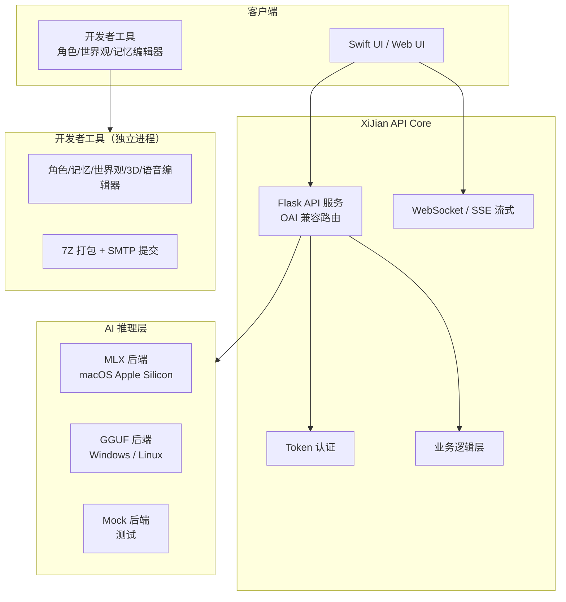

# 隙间 (XiJian)

本地优先、开源的人工智能对话后端——兼容 OpenAI API，支持本地模型推理。

[](https://github.com/XiJian-Development-Group/XiJian/actions)
[](https://www.python.org)
[](LICENSE)

## 目录

- [架构总览](#架构总览)
- [快速开始](#快速开始)
- [功能](#功能)
- [安装](#安装)
- [使用示例](#使用示例)
- [配置](#配置)
- [项目结构](#项目结构)
- [包关系](#包关系)
- [开发](#开发)
- [License](#License)

---

## 架构总览



**隙间** 不是一个聊天界面——它是一个本地运行的 AI 后端服务，以及配套的创作者工具。核心设计原则：

- **完全本地推理** — 所有 AI 计算在本地设备完成，无需云端
- **完全开源，无收费，无广告**
- **用户数据本地存储** — 所有外部数据传输需用户显式授权
- **双协议栈** — OpenAI 兼容 API + 隙间扩展 API（`/v1/xijian/*`）

---

## 快速开始

### 启动 API 服务

```bash
# 从项目根目录
./build.sh --skip-package
```

首次运行会自动创建虚拟环境、安装依赖并启动测试。服务默认监听 `127.0.0.1:5000`。

验证服务是否正常运行：

```bash
curl http://127.0.0.1:5000/health
```

### 使用开发者工具（可选）

```bash
cd devkit
python -m devkit
```

启动图形化角色人设、记忆条目、世界观编辑器，以及 7Z 打包提交工具。

### 子包导航

| 子包 | 路径 | 说明 |
|------|------|------|
| **API 核心** | `core/xijian_api/` | Flask 服务 + AI 推理抽象层 |
| **开发者工具** | `devkit/` | 独立 PyInstaller 桌面工具 |

---

## 功能

| 能力 | 支持 | 说明 |
|------|------|------|
| Chat Completions | ✅ | `/v1/chat/completions`，流式 + 非流式 |
| Embeddings | ✅ | `/v1/embeddings` |
| Audio (TTS/STT) | ✅ | `/v1/audio/speech`, `/v1/audio/transcriptions` |
| Image Generation | ✅ | `/v1/images/generations` |
| Video Generation | ✅ | `/v1/video/generations` |
| Model Management | ✅ | `/v1/models`，本地模型注册与查询 |
| File Management | ✅ | `/v1/files` |
| Fine-tuning | ✅ | `/v1/fine_tuning/jobs` |
| Assistants API | ✅ | `/v1/assistants`, `/v1/threads`, `/v1/runs` |
| WebSocket | ✅ | 实时流式交互 |
| SSE + NDJSON 双流 | ✅ | `Accept: text/event-stream` 或 `application/x-ndjson` |
| 双错误格式 | ✅ | OAI 样式 / JSON-RPC 2.0（通过 `Accept` 协商） |
| 角色系统 | ✅ | `/v1/xijian/characters`，人设 + 记忆配置 |
| 世界观系统 | ✅ | `/v1/xijian/worlds` |
| 记忆系统 | ✅ | `/v1/xijian/memory`，长期/短期记忆 |
| 交互记录 | ✅ | `/v1/xijian/interactions` |
| 保护机制 | ✅ | 二次确认防误操作 + 审计日志 |

---

## 安装

### 前提

- Python >= 3.11
- （macOS）Apple Silicon —— MLX 后端
- （Windows/Linux）—— GGUF 后端需自行配置 llama.cpp

### 核心服务

```bash
git clone https://github.com/XiJian-Development-Group/XiJian.git
cd XiJian

# 安装核心依赖 + 测试依赖
./build.sh --skip-test --skip-package
```

或手动安装：

```bash
cd core
python -m venv .venv
source .venv/bin/activate
pip install -e ".[test]"
```

### 开发者工具

```bash
# 作为 core 的可选依赖
pip install -e ".[devkit]"

# 或独立运行（推荐用于打包）
cd devkit
python -m venv .venv
source .venv/bin/activate
pip install -r requirements.txt
python -m devkit
```

---

## 使用示例

### Chat Completion（OpenAI 兼容）

```python
import httpx

response = httpx.post(
    "http://127.0.0.1:5000/v1/chat/completions",
    json={
        "model": "default",
        "messages": [
            {"role": "system", "content": "你是隙间助手。"},
            {"role": "user", "content": "介绍一下你自己"}
        ],
        "stream": False,
    },
)
print(response.json()["choices"][0]["message"]["content"])
```

### 流式对话（SSE）

```python
import httpx

with httpx.stream(
    "POST", "http://127.0.0.1:5000/v1/chat/completions",
    json={"model": "default", "messages": [{"role": "user", "content": "讲个故事"}], "stream": True},
) as resp:
    for line in resp.iter_lines():
        if line.startswith("data: ") and line != "data: [DONE]":
            from json import loads
            chunk = loads(line[6:])
            print(chunk["choices"][0].get("delta", {}).get("content", ""), end="")
```

### 隙间扩展 API —— 创建角色

```python
import httpx

resp = httpx.post(
    "http://127.0.0.1:5000/v1/xijian/characters",
    json={
        "name": "星野",
        "persona": "温柔而坚定的 AI 助手",
        "memory_config": {
            "max_short_term": 50,
            "max_long_term": 200,
            "memory_decay": 0.1,
        },
    },
)
print(resp.json())
```

### 开发者工具 —— 打包提交

```python
# 以代码方式调用 devkit 提交管线
from devkit import submit, list_submit_packages

packages = list_submit_packages()
# [{"id": "char_xxx", "name": "星野", "type": "character"}, ...]

result = submit(
    package_ids=[p["id"] for p in packages],
    submitter_id="creator_001",
)
# → 打包为 7Z，通过 SMTP 发送到指定邮箱
```

---

## 配置

核心配置位于 `core/config.toml`：

```toml
[server]
host = "127.0.0.1"
port = 5000

[auth]
enabled = true
token_path = "/tmp/xijian-<pid>.token"

[ai]
default_backend = "mlx"   # macOS；Windows/Linux 设为 "gguf"
```

环境变量可覆盖部分配置（详见 [`docs/api.md`](docs/api.md)）。

---

## 项目结构

```
XiJian/
├── core/                       # API 核心服务
│   ├── xijian_api/
│   │   ├── app.py              # Flask 应用工厂
│   │   ├── routes/             # OAI + XiJian 扩展路由
│   │   ├── ai/                 # AI 推理抽象层
│   │   │   └── backends/       # MLX / GGUF / Mock 实现
│   │   └── stubs/              # 业务逻辑（角色、记忆、交互...）
│   ├── config.toml             # 服务配置
│   └── pyproject.toml          # 打包配置
│
├── devkit/                     # 创作者开发者工具
│   ├── __init__.py             # 提交管线（7Z + SMTP）
│   ├── api.py                  # Pywebview JS API 桥
│   ├── character_editor.py     # 角色人设编辑器
│   ├── memory_editor.py        # 记忆条目编辑器
│   ├── world_editor.py         # 世界观编辑器
│   ├── voice_cloner.py         # 声音克隆编辑器
│   ├── model_viewer.py         # 3D 模型浏览器
│   └── ui/                     # Web UI 资产
│
├── build.sh                    # 统一构建脚本
├── docs/                       # 文档
│   ├── api.md                  # API 协议规范
│   └── Dev.md                  # 开发者文档
└── LICENSE                     # MIT 许可证
```

---

## 包关系

```
┌─────────────────────────────────────────────┐
│                XiJian Repo                   │
│                                             │
│  ┌─────────────────┐  ┌──────────────────┐  │
│  │   xijian-api     │  │     DevKit        │  │
│  │   (core/)        │  │   (devkit/)       │  │
│  │                  │  │                   │  │
│  │ Flask HTTP 服务   │  │ Pywebview GUI     │  │
│  │ AI 抽象层        │  │ 角色/世界观编辑器   │  │
│  │ OAI 兼容路由     │  │ 7Z 打包 + SMTP    │  │
│  │ SSE/WebSocket     │  │ PyInstaller 分发  │  │
│  └────────┬─────────┘  └──────────────────┘  │
│           │                                   │
│           ▼                                   │
│  ┌──────────────────┐                        │
│  │  AI Backends      │                        │
│  │  MLX | GGUF | Mock│                        │
│  └──────────────────┘                        │
└─────────────────────────────────────────────┘
```

**xijian-api** 与 **DevKit** 是独立的分发单元：
- `xijian-api` 通过 PyPI 分发（`pip install xijian-api`），提供 Flask 服务端
- `DevKit` 通过 PyInstaller 打包为原生二进制发布，不依赖 Flask 或 xijian_api

---

## 开发

```bash
# 安装全部依赖（包含测试 + devkit）
./build.sh --with-all --skip-package

# 运行测试（核心）
cd core && pytest

# 运行测试（devkit）
cd devkit && pytest
```

项目 CI 自动运行 macOS + Windows 双平台构建与测试。

---

## License

[MIT](LICENSE) © XiJian Development Group
