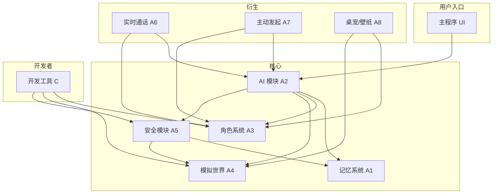

# Dev. Function List 功能清单 v2

> 隙间（XiJian）开发组 · 内部文档
>
> 文档版本：v2.1
> 上一版本：v1（`Dev. Function List功能清单.md`，Skyc8266 创建）
> 维护者：隙间开发组
> 用途：本产品功能开发的唯一权威来源（Single Source of Truth），开发、测试、产品设计均以此为准。
>
> 备注：本文档第一版为人工编写，后续版本由 Ai 辅助优化，人工审查修改

## v2.1 关键决策（2026-06-25 更新）

| 决策项 | 结论 | 备注 |
| --- | --- | --- |
| 角色模型 | **仅 3D（VRM）**，彻底移除 Live2D | 引擎栈：three.js + @pixiv/three-vrm（MIT，完全可商用） |
| 对话 TTS | **MeloTTS**（MIT，MLX/CPU 实时，中英混合） | Mac 本地首选 |
| 歌声 TTS | **DiffSinger**（Apache-2.0，OpenVPI） | 业界标杆，OpenUtau 集成 |
| 嵌入模型 | **bge-m3**（MIT，1024 维） | 中文 RAG 标配 |
| 主对话模型 | **Qwen2.5-7B Q4_K_M** | 中文最强，Apple Silicon 优化好 |
| 单世界角色总数上限 | **50** | 包含主角色 + 配角 |
| 单世界同时活跃配角 | **3 个高活跃** 或 **10 个低活跃**（二选一，不可叠加） | 互斥档位配置 |
| 过载档位 | **仅严格 / 适中两档** | 移除宽松档 |
| 对话延迟基线 | 略微上调（800ms→1200ms 本地，2s→3s 云端） | 为多角色并发让出排队余量 |

---

## 目录

- [0. 文档说明](#0-文档说明)
- [A. 用户功能](#a-用户功能)
  - [A1. 记忆系统](#a1-记忆系统)
  - [A2. OpenAI 兼容的 AI 模块](#a2-openai-兼容的-ai-模块)
  - [A3. 角色与状态系统](#a3-角色与状态系统)
  - [A4. 模拟世界系统](#a4-模拟世界系统)
  - [A5. 安全模块](#a5-安全模块)
  - [A6. 实时通话](#a6-实时通话)
  - [A7. 主动发起聊天或通话](#a7-主动发起聊天或通话仅支持-macos-与-iosipados)
  - [A8. 桌宠 / 动态壁纸](#a8-将角色可多个作为桌宠或动态壁纸仅支持-macos)
- [B. Apple TouchBar & Dynamic Island Support](#b-apple-touchbar--dynamic-island-supportonly-on-apple-devices)
- [C. Development Kit](#c-development-kitonly-windowslinuxmacos)
- [附录 A：核心数据模型汇总](#附录-a核心数据模型汇总)
- [附录 B：模块依赖关系](#附录-b模块依赖关系)
- [附录 C：变更日志](#附录-c变更日志)

---

## 0. 文档说明

### 0.1 范围与读者

| 读者 | 关注章节 |
| --- | --- |
| 产品 / 项目经理 | 全文，但优先看"用户故事 / 验收标准 / 边界场景" |
| 后端 / 算法工程师 | 数据模型、接口定义、流程图、状态机 |
| 前端 / 客户端工程师 | 接口定义、UI 流程、状态字段、缓存策略 |
| 测试 / QA | 验收标准、边界场景、状态机分支 |

### 0.2 文档约定

- **章节编号**沿用 v1 的 A/B/C 大节，子节顺延。删除或合并后会保留原编号并标注 `【v2 新增】/【v2 重写】/【v2 弃用】`。
- **每个子节统一格式**：
  1. **产品视角**：用户故事 → 功能清单 → 验收标准 → 边界场景
  2. **技术视角**：数据模型（SQLite 表）→ 接口定义 → 关键流程（Mermaid）→ 性能 / 安全要求
- **TODO 标记**：所有占位、待定、未指定项以 `[TODO: 说明]` 显式标注，列入附录。
- **Mermaid**：所有"关键流程都画"，包括但不限于：调用链、状态机、时序。

### 0.3 术语表

| 术语 | 含义 |
| --- | --- |
| 隙间（XiJian） | 本产品名，对应主程序 |
| 角色（Character） | 由 C2 流程创建，承载人设、模型、声音、记忆、状态的对象 |
| 世界（World） | 由 C1 流程创建的独立模拟环境，配有自己的世界观、场景、事件、配角、货币 |
| 配角（NPC） | 系统在世界内自动创建的次要角色，仅在所属世界中存在 |
| 记忆条目（Memory Entry） | 角色记忆系统中的一条记录，标记 `长期 / 短期`，具有重要性、遗忘度 |
| 受保护模块 | A5 涉及的、必须在备份中被特殊保护的子模块清单 |
| 上下文快照（Context Snapshot） | 包含角色、世界、记忆、对话历史的可恢复数据单元 |
| MCP | Model Context Protocol，本产品的 AI 工具调用与桌面控制通道 |
| 安全终止 | 用户通过快捷键触发的强制中断（A5.2） |
| 过载档位 | 系统过载防护的灵敏度档位（严格 / 适中） |

---

## A. 用户功能

### A1. 记忆系统

> 角色维度独立、按角色配置驱动的记忆子系统。使用 SQLite 持久化。

#### A1.1 用户管理与自动备份

**产品视角**

- **用户故事**
  - US-A1.1-01：作为用户，我可以为每个角色单独开启/关闭"自动备份受保护模块"，并看到最近一次备份时间。
  - US-A1.1-02：作为用户，我可以手动新增、编辑、删除某个角色的某一条记忆条目，并立即看到变更在后续对话中生效。
  - US-A1.1-03：作为用户，我可以恢复某一次备份到任意一个角色，必要时只恢复"记忆"而不恢复"状态"。
- **验收标准**
  - AC-1：受保护模块列表至少包含 `memory_entries / character_documents / world_documents / safety_snapshots`，新增需走版本流程。
  - AC-2：手动修改记忆条目后，下一轮对话必须可被读取（≤ 1s 内生效）。
  - AC-3：备份文件命名遵循 `{character_id}_{ISO8601}_v{n}.bak`，单角色最多保留 N 个版本（M1 默认 10，[TODO: 用户可配置]）。
- **边界场景**
  - 用户删除正在被长期记忆引用的条目 → 必须级联或软删除（保留 7 天可恢复）。
  - 备份过程中发生断电 → 自动恢复机制保证不损坏现有数据。

**技术视角**

- **数据模型**

  ```sql
  -- 受保护模块清单（可热更新）
  CREATE TABLE protected_modules (
    id           TEXT PRIMARY KEY,
    module_name  TEXT NOT NULL UNIQUE,
    description  TEXT,
    enabled      INTEGER NOT NULL DEFAULT 1, -- 0/1
    updated_at   INTEGER NOT NULL -- epoch ms
  );

  -- 角色与受保护模块的关联（粒度=角色）
  CREATE TABLE character_protected_module (
    character_id   TEXT NOT NULL,
    module_id      TEXT NOT NULL,
    auto_backup    INTEGER NOT NULL DEFAULT 1, -- 是否自动备份
    last_backup_at INTEGER,
    PRIMARY KEY(character_id, module_id)
  );

  -- 手动备份记录
  CREATE TABLE manual_backups (
    id             TEXT PRIMARY KEY,
    character_id   TEXT NOT NULL,
    scope          TEXT NOT NULL, -- 'all' | 'memory_only' | 'state_only' | 'doc_only'
    file_path      TEXT NOT NULL,
    size_bytes     INTEGER NOT NULL,
    created_at     INTEGER NOT NULL,
    created_by     TEXT NOT NULL -- 'user' | 'system'
  );

  -- 记忆条目（详见 A1.2）
  ```

- **接口定义**
  - `GET /v1/characters/{cid}/memory/entries?type=&page=` — 分页查询
  - `POST /v1/characters/{cid}/memory/entries` — 新增（body 校验：`type` ∈ {long, short}）
  - `PATCH /v1/entries/{eid}` — 修改（仅 `content`/`importance`/`tags` 可改）
  - `DELETE /v1/entries/{eid}` — 软删除（写入 `deleted_at`）
  - `POST /v1/backups` — 触发手动备份
  - `POST /v1/backups/{bid}/restore` — 恢复（可选 `scope`）
  - `GET /v1/protected-modules` — 列出受保护模块
- **自动备份策略**
  - 触发条件：定时（每日凌晨）+ 事件触发（手动修改 50 条以上 / 角色首次加载 / 安全终止之后）
  - 备份文件格式：SQLite Dump + JSON 元信息；压缩采用 zstd
  - 失败重试：指数退避，最多 3 次

#### A1.2 系统自动记忆管理与强制对话调用

**产品视角**

- **用户故事**
  - US-A1.2-01：作为用户，我可以为每个角色配置"记忆力""短期记忆衰减速度""最大上下文装载量"等参数。
  - US-A1.2-02：作为用户，我在新开对话时无需关心记忆如何被自动载入——历史人物、事件、承诺等都能被角色正确回忆。
  - US-A1.2-03：作为用户，角色在回复中提到任何过往信息时，我能确信它是"真实"发生过或被记录过的，而不是幻觉。
- **功能清单**
  - 每个角色独立维护 `character_memory_config`
  - 长期记忆按"重要性 + 访问频次 + 显式标记"决定保留
  - 短期记忆按"遗忘曲线"自动衰减（详见数据模型）
  - 新对话开始时，根据配置自动挑选长期记忆 + 必要的短期记忆进入上下文
  - 模型回复前，系统强制注入"记忆召回检查"，涉及过往信息必须从记忆库调取
- **验收标准**
  - AC-1：长期记忆在每次新对话 100% 必载入（上限受配置约束）。
  - AC-2：短期记忆的衰减参数可独立于长期记忆。
  - AC-3：当模型回复中包含可被记忆库验证的事实但未引用时，审查模块必须记录 warning。
  - AC-4：模型回复中不允许凭空捏造过去对话内容（无对应 memory_entry）。
- **边界场景**
  - 配置中的 `max_long_term` 设为 0 → 角色无长期记忆，仅短期记忆生效。
  - 上下文窗口剩余空间 < 配置的 10% → 触发"按重要性裁剪"而非全量注入。
  - 同一条目同时匹配"长期"和"短期"判定 → 以更高级别为准。

**技术视角**

- **数据模型**

  ```sql
  -- 角色记忆配置（每角色独立）
  CREATE TABLE character_memory_config (
    character_id              TEXT PRIMARY KEY,
    -- 长期记忆
    max_long_term             INTEGER NOT NULL DEFAULT 200, -- 装载上限（条）
    long_term_importance_min  REAL    NOT NULL DEFAULT 0.6, -- 入选阈值 0~1
    -- 短期记忆
    max_short_term            INTEGER NOT NULL DEFAULT 50,
    short_term_decay_rate     REAL    NOT NULL DEFAULT 0.05, -- 每小时衰减
    short_term_importance_min REAL    NOT NULL DEFAULT 0.3,
    -- 上下文注入
    max_context_tokens        INTEGER NOT NULL DEFAULT 8000,
    reserve_tokens_for_reply  INTEGER NOT NULL DEFAULT 2000,
    -- 召回行为
    force_recall_on_history   INTEGER NOT NULL DEFAULT 1, -- 0/1
    -- 时间戳
    updated_at                INTEGER NOT NULL
  );

  -- 记忆条目
  CREATE TABLE memory_entries (
    id              TEXT PRIMARY KEY,
    character_id    TEXT NOT NULL,
    type            TEXT NOT NULL CHECK(type IN ('long','short')),
    content         TEXT NOT NULL, -- Markdown / 结构化 JSON
    importance      REAL NOT NULL DEFAULT 0.5, -- 0~1
    source          TEXT NOT NULL, -- 'dialogue' | 'manual' | 'world_event' | 'derived'
    source_ref_id   TEXT, -- 关联的对话/事件 ID
    tags            TEXT, -- JSON 数组
    embedding       BLOB, -- [TODO: 决定使用本地模型还是接入外部 embedding]
    embedding_model TEXT,
    access_count    INTEGER NOT NULL DEFAULT 0,
    last_access_at  INTEGER,
    decay_score     REAL NOT NULL DEFAULT 1.0, -- 短期记忆动态衰减分
    created_at      INTEGER NOT NULL,
    deleted_at      INTEGER
  );
  CREATE INDEX idx_memory_char_type ON memory_entries(character_id, type);
  CREATE INDEX idx_memory_decay    ON memory_entries(type, decay_score);

  -- 记忆引用记录（用于"幻觉"审查）
  CREATE TABLE memory_citations (
    id           TEXT PRIMARY KEY,
    response_id  TEXT NOT NULL, -- 关联到一次回复
    entry_id     TEXT NOT NULL,
    citation_kind TEXT NOT NULL CHECK(citation_kind IN ('direct','paraphrase','inferred'))
  );
  ```

- **关键流程：自动记忆载入与强制调用**

  ```mermaid
  sequenceDiagram
      autonumber
      participant U as 用户
      participant S as 隙间主程序
      participant M as 记忆服务
      participant AI as AI 模块
      participant SA as 安全审查

      U->>S: 发起新对话 / 输入消息
      S->>M: loadContext(character_id, budget_tokens)
      M->>M: 1) 读取 character_memory_config
      M->>M: 2) 选取长期记忆（按 importance + tags + recency 排序，取 top N）
      M->>M: 3) 选取短期记忆（按 decay_score ≥ 阈值，取 top K）
      M->>M: 4) 拼接为 system prompt + history
      M-->>S: 返回 context 包
      S->>AI: 发送 prompt + 上下文 + 用户消息
      AI-->>S: 流式生成回复（含 tool_calls）
      S->>SA: 提交回复 + memory_citations 候选
      SA->>M: 反查 entry_id 是否真实存在
      SA-->>S: 审查结果（pass / warn / block）
      S-->>U: 渲染回复 + （如有）warning
      S->>M: 写入新产生的短期记忆（type=short, source=dialogue）
      M->>M: 更新 access_count / last_access_at / decay_score
  ```

- **遗忘算法**
  - 短期记忆衰减分：`decay_score(t) = decay_score(t0) * exp(-short_term_decay_rate * Δh)`
  - 当 `decay_score < short_term_importance_min` 且 `access_count < 2` → 自动升级为长期记忆候选（需 importance ≥ 0.5）
  - 长期记忆永不衰减，但可被用户手动删除或被管理员标记为"过期"
- **强制调用规则**
  
  - 在系统 prompt 中强制注入"涉及过往信息时必须先调用 `recall_memory(query)` 工具"
  - 工具返回的 entry_id 必须出现在最终回复的引用列表中，否则 SA 记录 warning
  - 若模型在无工具结果的情况下生成历史细节，SA 直接 block 并触发重生成（最多 2 次）

---

### A2. OpenAI 兼容的 AI 模块

> 隙间对外暴露一套与 OpenAI 兼容的 API，支持多模态与工具调用。

#### 产品视角

- **用户故事**
  - US-A2-01：作为开发者/高级用户，我可以使用任意 OpenAI SDK 接入隙间，享受相同的接口体验。
  - US-A2-02：作为用户，我可以让角色生成图像、语音、短视频，或在工具调用驱动下操作系统。
- **功能清单**
  - 兼容 `chat.completions`（含流式）、`embeddings`、`audio.speech`、`audio.transcriptions`、`images.generations`、`videos.generations`
  - 工具调用：MCP 工具描述注入 → 模型决定调用 → 隙间执行 → 结果回灌
  - 多模态上下文：图片、音频、视频片段可作为输入消息的一部分
  - 角色适配层：自动注入人设、记忆、状态、当前世界上下文
- **验收标准**
  - AC-1：使用 `openai-python` 直连时，除 base_url 之外不需任何代码改动。
  - AC-2：流式首字节延迟 < **1200ms**（本地模型）/ < **3s**（云端 API）。【v2.1 略微上调，为 3 个 high_active 配角并发让出排队余量】
  - AC-3：工具调用协议必须实现 OpenAI Function Calling 最新规范。
- **边界场景**
  - 模型本身不支持某模态（如纯文本模型收到图像输入）→ 必须降级为占位描述并记录失败。
  - 工具调用结果超过上下文窗口 → 摘要后回灌，并保留原始结果在 memory。

#### 技术视角

- **接口映射**

  | OpenAI 端点 | 隙间实现 |
  | --- | --- |
  | POST `/v1/chat/completions` | 路由至模型后端，注入角色上下文 |
  | POST `/v1/embeddings` | 用于记忆检索；可切换本地/云端 |
  | POST `/v1/audio/speech` | TTS 引擎（C2.1 声音设计产物） |
  | POST `/v1/audio/transcriptions` | STT 引擎（A6 通话输入） |
  | POST `/v1/images/generations` | 图像生成（含角色一致性参考） |
  | POST `/v1/videos/generations` | 视频生成（含笔迹/动作参考） |

- **角色上下文注入顺序**

  ```mermaid
  flowchart TD
    A[用户/工具调用请求] --> B[安全预检 A5.1]
    B --> C[加载角色人设文档 C2.4]
    C --> D[加载记忆上下文 A1.2]
    D --> E[加载当前状态 A3.2]
    E --> F[加载世界上下文 A4]
    F --> G[拼接 system + history]
    G --> H[调用模型后端]
    H --> I[流式输出 + 工具调用循环]
    I --> J[安全后审 A5.1]
    J --> K[记忆回写 A1.2]
  ```

- **多模态支持矩阵** [TODO: 列出每个模型后端支持的模态]
- **工具调用（MCP）**
  - 协议版本：跟随 MCP 最新 spec
  - 工具清单包括但不限于：桌面控制、文件操作、应用启动、浏览器自动化（仅 macOS 桌宠）

---

### A3. 角色与状态系统

> 角色是隙间最核心的对象。信息系统管理"我是谁"，状态系统管理"我现在怎么样"。

#### A3.1 角色信息系统

**产品视角**

- **用户故事**
  - US-A3.1-01：作为用户，我可以为同一角色绑定多个 3D 模型版本（VRM 1.0 / FBX / GLB），并切换使用。
  - US-A3.1-02：作为用户，角色首次对话时的模型加载、贴图、声音延迟可接受范围内（< 3s）。
  - US-A3.1-03：作为开发者，我可以为角色上传多套服装、多个表情参数（VRM BlendShape / blend shape proxy）。
- **功能清单**
  - 角色基础档案：人设文档、3D 模型（VRM + 贴图）、动作库、声音数据、笔迹数据（备用）、语言风格
  - 自动缓存：高频使用的数据（多角度形象图、模型贴图、常用动作片段、声音样本）常驻内存/磁盘缓存
  - 一致性参考：在图像/视频生成时作为参考输入，确保跨模态一致
- **验收标准**
  - AC-1：首次加载 < 3s（本地资源命中缓存时 < 500ms）
  - AC-2：贴图分辨率支持 4K、贴图切换 < 200ms
  - AC-3：动作库至少支持 idle / happy / sad / angry / surprised / 角色自定义 N 种
  - AC-4：笔迹数据当前不参与生成流水线，但必须存档以备未来启用

**技术视角**

- **数据模型**

  ```sql
  -- 角色基本信息（与人设文档分离，文档存文件）
  CREATE TABLE characters (
    id              TEXT PRIMARY KEY,
    display_name    TEXT NOT NULL,
    description     TEXT, -- 展示给用户看的简介
    language_style  TEXT, -- 语言风格描述
    created_at      INTEGER NOT NULL,
    updated_at      INTEGER NOT NULL,
    is_archived     INTEGER NOT NULL DEFAULT 0
  );

  -- 角色资源（多版本）
  CREATE TABLE character_models (
    id              TEXT PRIMARY KEY,
    character_id    TEXT NOT NULL,
    kind            TEXT NOT NULL CHECK(kind IN ('vrm','fbx','glb','sprite')),
    file_path       TEXT NOT NULL,
    texture_paths   TEXT, -- JSON 数组
    rig_meta        TEXT, -- JSON 元数据（参数名、绑定点、BlendShape 名）
    version         INTEGER NOT NULL DEFAULT 1,
    is_active       INTEGER NOT NULL DEFAULT 0
  );

  -- 动作库
  CREATE TABLE character_motions (
    id              TEXT PRIMARY KEY,
    character_id    TEXT NOT NULL,
    name            TEXT NOT NULL, -- 业务名，如 'greeting'
    file_path       TEXT NOT NULL,
    duration_ms     INTEGER NOT NULL,
    trigger_tags    TEXT, -- JSON：触发此动作的情感/事件标签
    priority        INTEGER NOT NULL DEFAULT 0
  );

  -- 声音数据
  CREATE TABLE character_voices (
    id              TEXT PRIMARY KEY,
    character_id    TEXT NOT NULL,
    name            TEXT NOT NULL, -- 如 'default' / 'whisper'
    engine          TEXT NOT NULL, -- 'tts_engine_v1' ...
    voice_ref_path  TEXT NOT NULL, -- 声音样本或模型
    params_json     TEXT, -- 引擎参数
    is_default      INTEGER NOT NULL DEFAULT 0
  );

  -- 笔迹数据（C2.2 暂不开放，但模型字段保留）
  CREATE TABLE character_handwritings (
    id              TEXT PRIMARY KEY,
    character_id    TEXT NOT NULL,
    sample_path     TEXT NOT NULL, -- 输入样本（图/文）
    generated_path  TEXT, -- 生成的笔迹模型
    status          TEXT NOT NULL DEFAULT 'pending' -- 'pending' | 'ready' | 'disabled'
  );

  -- 语言风格
  CREATE TABLE character_styles (
    id              TEXT PRIMARY KEY,
    character_id    TEXT NOT NULL UNIQUE,
    style_doc       TEXT NOT NULL, -- Markdown
    forbidden_words TEXT, -- JSON 数组
    catchphrases    TEXT -- JSON 数组
  );

  -- 缓存条目
  CREATE TABLE character_asset_cache (
    id              TEXT PRIMARY KEY,
    character_id    TEXT NOT NULL,
    asset_kind      TEXT NOT NULL, -- 'texture' | 'pose_image' | 'audio_clip' | ...
    asset_ref       TEXT NOT NULL,
    size_bytes      INTEGER NOT NULL,
    hit_count       INTEGER NOT NULL DEFAULT 0,
    last_hit_at     INTEGER,
    expires_at      INTEGER -- TTL，空=永不过期
  );
  ```

- **加载策略**
  - 启动时：仅加载 `is_active=1` 的模型 + 默认声音 + 默认风格
  - 对话中：按动作触发标签按需加载 motion（LRU 缓存上限 [TODO]）
  - 切换贴图/换装：异步预加载下一套资源
- **跨模态一致性**
  - 图像生成：注入 `pose_image` 作为参考图
  - 视频生成：注入 `motion_clip` + 角色贴图 + 声音

#### A3.2 角色状态系统

**产品视角**

- **用户故事**
  - US-A3.2-01：作为用户，我能直观看到角色当前的饱食、饮水、健康、心情数值，并在 UI 上以拟物方式呈现（如角色头顶图标）。
  - US-A3.2-02：作为用户，角色的状态会随时间、与我的互动、世界事件而自然变化。
  - US-A3.2-03：作为开发者，我可以通过角色文档与配置，自定义状态衰减率、阈值触发的事件等。
- **功能清单**
  - 状态字段：`饱食 (hunger)`、`饮水 (thirst)`、`健康 (health)`、`心情 (mood)`
  - 数值范围：默认 0~100，可由角色配置覆盖
  - 时间衰减：定时器按"角色配置"中的衰减率减少
  - 事件影响：与用户的对话、世界事件可触发加减
  - 状态→行为映射：低饱食可能让角色表现出疲惫；高心情让角色更健谈
- **验收标准**
  - AC-1：状态值始终在 [0, max] 之间，超界自动 clamp
  - AC-2：状态变更必须留下日志（含原因）
  - AC-3：UI 端到端更新延迟 < 500ms
- **边界场景**
  - 健康 ≤ 0 → 角色不可对话，进入"恢复中"状态；UI 显示警告
  - 心情 ≥ 95 且 hunger < 20 → 角色可能触发自定义台词/动作

**技术视角**

- **数据模型**

  ```sql
  CREATE TABLE character_states (
    character_id  TEXT PRIMARY KEY,
    hunger        REAL NOT NULL DEFAULT 80,
    thirst        REAL NOT NULL DEFAULT 80,
    health        REAL NOT NULL DEFAULT 100,
    mood          REAL NOT NULL DEFAULT 70,
    max_hunger    REAL NOT NULL DEFAULT 100,
    max_thirst    REAL NOT NULL DEFAULT 100,
    max_health    REAL NOT NULL DEFAULT 100,
    max_mood      REAL NOT NULL DEFAULT 100,
    last_updated  INTEGER NOT NULL
  );

  CREATE TABLE character_state_configs (
    character_id          TEXT PRIMARY KEY,
    hunger_decay_per_hour REAL NOT NULL DEFAULT 2,
    thirst_decay_per_hour REAL NOT NULL DEFAULT 3,
    health_decay_per_hour REAL NOT NULL DEFAULT 0.1,
    mood_decay_per_hour   REAL NOT NULL DEFAULT 1,
    -- 阈值事件触发
    low_hunger_threshold  REAL NOT NULL DEFAULT 30,
    low_mood_threshold    REAL NOT NULL DEFAULT 20,
    -- 行为映射
    behavior_bindings     TEXT -- JSON：state→motion/trigger
  );

  CREATE TABLE character_state_log (
    id            TEXT PRIMARY KEY,
    character_id  TEXT NOT NULL,
    field         TEXT NOT NULL,
    old_value     REAL NOT NULL,
    new_value     REAL NOT NULL,
    reason        TEXT NOT NULL, -- 'tick' | 'dialogue' | 'world_event' | 'manual'
    ref_id        TEXT,
    created_at    INTEGER NOT NULL
  );
  ```

- **状态机**

  ```mermaid
  stateDiagram-v2
      [*] --> Healthy
      Healthy --> Hungry: hunger ≤ 30
      Hungry --> Healthy: hunger > 60 持续 5 min
      Healthy --> Thirsty: thirst ≤ 30
      Thirsty --> Healthy: thirst > 60 持续 5 min
      Healthy --> Sick: health ≤ 30
      Sick --> Recovering: 触发恢复事件
      Recovering --> Healthy: health > 70 持续 10 min
      Sick --> Critical: health ≤ 0
      Critical --> [*]: 强制恢复（用户/管理员介入）
  ```

- **衰减算法**
  - 每 N 秒 tick 一次（[TODO: N 默认 60s]）
  - 实际衰减 = 配置值 × 时间因子 × 世界/活动修饰因子（[TODO]）
  - 状态改变同时写入 `character_state_log` 并触发 UI 推送

---### A4. 模拟世界系统

> 一个或多个由世界观文档驱动、可独立运行的模拟环境。世界内有独立时间线、配角、事件、经济。

#### A4.1 突发 / 常见事件自动管理

**产品视角**

- **用户故事**
  - US-A4.1-01：作为用户，我在世界中时，世界会自然产生常见事件（节日、市集、天气变化），无需我干预。
  - US-A4.1-02：作为用户，我可以在世界配置里开启/关闭某一类事件（战斗、日常、社交）。
  - US-A4.1-03：作为用户，部分事件会触发"场景生成"，我可以直接进入新场景。
- **功能清单**
  - 事件库：内置 + 用户自定义（C1.1）
  - 触发器：时间（节日）、条件（角色/世界状态）、概率（日常随机）
  - 场景自动生成：事件需要时调用图像/3D 生成
  - 用户管理面板：每类事件可独立启停、阈值、频率
- **验收标准**
  - AC-1：事件触发后必须在 1s 内完成"通知 + 入库"
  - AC-2：场景生成失败时必须有降级（占位图 + 文字描述）
  - AC-3：被用户关闭的事件类不会自动触发
- **边界场景**
  - 高频事件风暴：必须节流（[TODO: 默认 60s 内最多 1 个事件]）
  - 多个事件同时要求场景生成：排队，超过阈值时丢弃低优先级

**技术视角**

- **数据模型**

  ```sql
  CREATE TABLE world_events (
    id              TEXT PRIMARY KEY,
    world_id        TEXT NOT NULL,
    kind            TEXT NOT NULL, -- 'common' | 'custom' | 'incident'
    name            TEXT NOT NULL,
    description     TEXT,
    trigger_config  TEXT NOT NULL, -- JSON：触发条件
    scene_ref_id    TEXT, -- 关联场景（如有）
    priority        INTEGER NOT NULL DEFAULT 0,
    is_enabled      INTEGER NOT NULL DEFAULT 1,
    cooldown_until  INTEGER,
    created_at      INTEGER NOT NULL
  );

  CREATE TABLE world_event_instances (
    id              TEXT PRIMARY KEY,
    event_id        TEXT NOT NULL, -- 指向 world_events
    world_id        TEXT NOT NULL,
    fired_at        INTEGER NOT NULL,
    resolved_at     INTEGER,
    payload         TEXT, -- 事件具体参数
    affected_npcs   TEXT, -- JSON 数组
    affects_user    INTEGER NOT NULL DEFAULT 0
  );
  ```

- **事件调度流程**

  ```mermaid
  flowchart LR
      T[定时器 tick] --> Q[取出世界 + 事件配置]
      Q --> E{评估触发器}
      E -- 命中 --> C{冷却中?}
      C -- 是 --> Skip[跳过]
      C -- 否 --> CD{检查用户禁用?}
      CD -- 是 --> Skip
      CD -- 否 --> S[生成事件实例 + 写库]
      S --> SG{需要场景?}
      SG -- 是 --> Gen[异步生成场景]
      SG -- 否 --> Notif[推送给用户/角色]
      Gen --> Notif
      Notif --> Persist[写入角色/世界状态]
  ```

#### A4.2 世界总管理

**产品视角**

- **用户故事**
  - US-A4.2-01：作为用户，我可以同时维护多个世界（如原神、崩铁、自创），并在它们之间切换。
  - US-A4.2-02：作为用户，每个世界都会自动生成大量配角，他们有自己的小算力用于自我决策。
  - US-A4.2-03：作为用户，我可以重置世界、小幅度修改世界（天气、时间、关键 NPC）。
  - US-A4.2-04：作为用户，世界内发生的事会自动影响我与角色的记忆。
- **功能清单**
  - 多世界并发：每个世界独立进程/独立线程，资源隔离
  - 自动配角生成：基于世界观文档 + 模板生成 NPC
  - 配角算力分配：总预算分摊到每个 NPC
  - 环境模拟：天气、时间、光照、环境音效
  - 重置 / 小幅修改：用户可指定 scope
  - 影响回写：事件可能写入角色记忆（A1.2）
- **验收标准**
  - AC-1：单实例支持至少 3 个并发世界（已固定）
  - AC-2：每个世界的状态变更必须在 500ms 内持久化
  - AC-3：配角决策必须有节流与超时
  - AC-4：用户重置世界前必须确认（双重确认）
  - AC-5：**单世界角色总数上限 50 个**（含主角色 + 全部配角；超过则新建世界或归档）
  - AC-6：**同时活跃配角上限 3 个**（high-active 档），或 10 个（low-active 档，**二选一**）
- **边界场景**
  - 算力不足：配角决策降级为"基于最近一次状态静态选择"
  - 修改导致事件链断裂：提示用户并要求选择（保留 / 丢弃后续事件）

**技术视角**

- **数据模型**

  ```sql
  -- 世界
  CREATE TABLE worlds (
    id              TEXT PRIMARY KEY,
    name            TEXT NOT NULL,
    world_doc_path  TEXT NOT NULL, -- 世界观 Markdown
    config_path     TEXT NOT NULL,
    state_doc_path  TEXT NOT NULL,
    is_active       INTEGER NOT NULL DEFAULT 1,
    last_active_at  INTEGER,
    created_at      INTEGER NOT NULL,
    updated_at      INTEGER NOT NULL
  );

  -- 配角
  CREATE TABLE npcs (
    id              TEXT PRIMARY KEY,
    world_id        TEXT NOT NULL,
    name            TEXT NOT NULL,
    persona_doc     TEXT,
    state_json      TEXT NOT NULL, -- 饱食/心情/位置等
    compute_budget  INTEGER NOT NULL DEFAULT 100, -- token/分钟
    is_alive        INTEGER NOT NULL DEFAULT 1,
    activity_tier   TEXT NOT NULL DEFAULT 'low_active', -- 'high_active' | 'low_active' | 'idle'
    importance      REAL NOT NULL DEFAULT 1.0, -- 剧情重要度权重
    last_think_at   INTEGER,
    created_at      INTEGER NOT NULL
  );

  -- 配角调度日志（用于算力回溯与降级决策）
  CREATE TABLE npc_scheduling_log (
    id              TEXT PRIMARY KEY,
    npc_id          TEXT NOT NULL,
    world_id        TEXT NOT NULL,
    action          TEXT NOT NULL, -- 'spawn' | 'tick' | 'degrade' | 'sleep' | 'wake'
    from_tier       TEXT,
    to_tier         TEXT,
    reason          TEXT, -- 'overload' | 'idle_timeout' | 'manual' | 'world_reset'
    created_at      INTEGER NOT NULL
  );

  -- 单世界世界级配额配置
  CREATE TABLE world_compute_config (
    world_id              TEXT PRIMARY KEY,
    total_token_budget    INTEGER NOT NULL DEFAULT 50000, -- tokens/min
    active_tier           TEXT NOT NULL DEFAULT 'low_active', -- 'high_active' | 'low_active'
    max_npcs              INTEGER NOT NULL DEFAULT 50,
    max_active_npcs       INTEGER NOT NULL DEFAULT 3, -- high_active 上限；low_active 上限=10
    updated_at            INTEGER NOT NULL
  );

  -- 环境
  CREATE TABLE world_environment (
    world_id        TEXT PRIMARY KEY,
    weather         TEXT NOT NULL, -- 'sunny' | 'rain' | 'snow' | ...
    time_of_day     INTEGER NOT NULL, -- 0~1440 分钟
    light_level     REAL NOT NULL,   -- 0~1
    ambient_audio   TEXT, -- 资源路径
    env_meta        TEXT -- JSON 扩展
  );

  -- 世界事件链日志
  CREATE TABLE world_audit_log (
    id            TEXT PRIMARY KEY,
    world_id      TEXT NOT NULL,
    action        TEXT NOT NULL, -- 'reset' | 'patch' | 'npc_create' | ...
    actor         TEXT NOT NULL, -- 'user' | 'system'
    payload       TEXT,
    created_at    INTEGER NOT NULL
  );
  ```

- **世界调度架构**

  ```mermaid
  flowchart TB
      subgraph 核心调度
        WM[World Manager]
      end
      WM --> WCC1[world_compute_config<br/>tier=high_active|low_active]
      WM --> W1[World A]
      WM --> W2[World B]
      WM --> W3[World C]
      W1 --> S1[Scene Engine]
      W1 --> E1[Event Engine]
      W1 --> N1[NPC Agents<br/>tier=high_active ×3]
      W1 --> N2[NPC Agents<br/>tier=low_active ×10]
      W1 --> N3[NPC idle]
      W1 --> Env1[Env Simulator]
      W1 --> Eco1[Economy Engine]
      W1 --> SL[npc_scheduling_log]
  ```

- **配角算力调度**【v2.1 决策】
  - **总预算**：50,000 tokens/min / 世界（已固定，作为调度基线）
  - **活跃档位（二选一，运行时切换）**：

    | 档位 | 同时活跃数 | 单 NPC 配额 | 思考间隔 | 适用场景 |
    | --- | --- | --- | --- | --- |
    | `high_active` | **3** | ~16.6k tokens/min | 5s | 剧情高潮、关键互动 |
    | `low_active`  | **10** | ~5k tokens/min | 15s | 日常推进、长周期事件 |

  - 角色调度权重 = `剧情重要度 × 互动热度衰减系数`（默认 1.0）
  - 总配额超 50k → 调度器把多余 NPC 切到 `idle`，仅保留心跳（每 60s 检查一次）
  - **总角色数硬上限：50**（含主角色 + 全部 NPC），创建第 51 个必须归档或新建世界
  - 思考产物 = 一句话意图 → 推进 NPC state_json
  - **算力不足降级**：当 LLM 队列 P99 延迟 > 5s 时，自动把 `high_active` 档的某些 NPC 降为 `low_active`，记录到 `npc_scheduling_log`

#### A4.3 场景与互动

**产品视角**

- **用户故事**
  - US-A4.3-01：作为用户，我可以选不同交通方式（步行/载具/传送）从一个地点到另一个地点。
  - US-A4.3-02：作为用户，我可以与场景内任意对象互动（NPC/物品/机关），并产生对角色/世界的影响。
  - US-A4.3-03：作为用户，互动结果会自然反映到后续对话和记忆中。
- **功能清单**
  - 地点（POI）系统：地图 / 区域 / 兴趣点三级
  - 交通方式：每种方式有"时间/体力/剧情影响"
  - 互动：对话、战斗、交易、采集等
  - 影响传播：互动结果可能修改 NPC state、角色 state、世界 environment
- **验收标准**
  - AC-1：场景切换时画面/音效过渡 < 2s
  - AC-2：互动结果必须可回溯（写入 audit_log）
  - AC-3：交通方式的体力消耗必须真实扣减
- **边界场景**
  - 角色处于"不可互动"状态（如健康 ≤ 0）→ 必须阻止场景内危险互动

**技术视角**

- **数据模型**

  ```sql
  CREATE TABLE pois (
    id              TEXT PRIMARY KEY,
    world_id        TEXT NOT NULL,
    parent_id       TEXT, -- 区域/地图
    name            TEXT NOT NULL,
    kind            TEXT NOT NULL, -- 'city' | 'wild' | 'dungeon' | 'shop'
    coords          TEXT, -- JSON: x,y 或 polygon
    description     TEXT
  );
  
  CREATE TABLE travel_modes (
    id              TEXT PRIMARY KEY,
    world_id        TEXT NOT NULL,
    name            TEXT NOT NULL, -- 'walk' / 'horse' / 'teleport'
    speed_factor    REAL NOT NULL,
    stamina_cost    REAL NOT NULL,
    event_chance    REAL NOT NULL DEFAULT 0 -- 路上遇事件概率
  );
  
  CREATE TABLE interactions (
    id              TEXT PRIMARY KEY,
    world_id        TEXT NOT NULL,
    poi_id          TEXT NOT NULL,
    target_type     TEXT NOT NULL, -- 'npc' | 'object' | 'mechanism'
    target_id       TEXT NOT NULL,
    action          TEXT NOT NULL,
    effects         TEXT NOT NULL, -- JSON：角色/世界/NPC 影响
    cooldown_sec    INTEGER NOT NULL DEFAULT 0
  );
  ```

#### A4.4 经济系统

**产品视角**

- **用户故事**
  - US-A4.4-01：作为用户，我可以通过合法/非法方式（卖东西、抢银行）获取世界货币（如原神摩拉、崩铁信用点）。
  - US-A4.4-02：作为用户，我可以购买物品、进行交易。
  - US-A4.4-03：作为用户，我知道这个世界的"其他角色"可以偷我、骗我，因此我可能需要谨慎操作。
  - US-A4.4-04：作为开发者，我可以为世界接入自定义经济总系统（模拟）。
- **功能清单**
  - 货币：每世界独立货币定义
  - 余额：用户、每个 NPC 各自有余额
  - 交易：商品上架/购买/出售
  - 非法手段：抢劫、诈骗、盗窃（NPC 主动）
  - 经济总系统：供需、通胀、季节性变化（可模拟）
- **验收标准**
  - AC-1：所有资金变动必须写入 transactions 表
  - AC-2：NPC 主动偷窃/诈骗必须有合理判定与冷却
  - AC-3：用户可配置"是否允许非法手段"
- **边界场景**
  - 用户余额为负 → 禁止继续交易（除非启用"赊账"）
  - 经济系统崩溃（极端通胀）→ 触发世界重置确认

**技术视角**

- **数据模型**

  ```sql
  CREATE TABLE world_currencies (
    world_id        TEXT NOT NULL,
    code            TEXT NOT NULL, -- 'mora' / 'credit' / 'gold'
    name            TEXT NOT NULL,
    symbol          TEXT,
    decimals        INTEGER NOT NULL DEFAULT 0,
    PRIMARY KEY(world_id, code)
  );

  CREATE TABLE wallets (
    owner_kind      TEXT NOT NULL, -- 'user' | 'npc'
    owner_id        TEXT NOT NULL,
    world_id        TEXT NOT NULL,
    currency_code   TEXT NOT NULL,
    balance         REAL NOT NULL DEFAULT 0,
    PRIMARY KEY(owner_kind, owner_id, world_id, currency_code)
  );

  CREATE TABLE transactions (
    id              TEXT PRIMARY KEY,
    world_id        TEXT NOT NULL,
    from_kind       TEXT NOT NULL, -- 'user' | 'npc'
    from_id         TEXT NOT NULL,
    to_kind         TEXT NOT NULL,
    to_id           TEXT NOT NULL,
    currency_code   TEXT NOT NULL,
    amount          REAL NOT NULL,
    kind            TEXT NOT NULL, -- 'purchase' | 'sale' | 'theft' | 'scam' | 'reward'
    ref_id          TEXT,
    created_at      INTEGER NOT NULL
  );

  CREATE TABLE world_economy_state (
    world_id        TEXT PRIMARY KEY,
    inflation_rate  REAL NOT NULL DEFAULT 0,
    liquidity_index REAL NOT NULL DEFAULT 1,
    last_tick_at    INTEGER NOT NULL
  );
  ```

- **NPC 主动盗窃/诈骗流程**

  ```mermaid
  sequenceDiagram
      autonumber
      participant N as NPC
      participant E as Economy Engine
      participant U as 用户
      participant SA as 安全模块
      N->>E: 决策：尝试盗窃/诈骗
      E->>E: 判定（性格 + 警觉 + 随机）
      alt 成功
          E->>U: 扣减余额
          E->>N: 入账
          E->>SA: 记录事件
          SA-->>U: 通知"被偷/被骗"
      else 失败
          E->>U: 通知"未遂"
          E->>SA: 记录未遂
      end
  ```

- **经济总系统 tick**：每 N 分钟根据世界事件/交易量/季节因子更新 `inflation_rate` 与 `liquidity_index`

---

### A5. 安全模块

> 安全模块是隙间所有危险行为的最后一道关卡。**默认严格，禁止完全关闭**。

#### A5.1 模型输出审查

**产品视角**

- **用户故事**
  - US-A5.1-01：作为用户，我可以放心地与角色对话，不会出现明显 OOC（突破人设）的回复。
  - US-A5.1-02：作为用户，在模拟世界内"极度危险事件"下，即使是平时冷静的角色也可以展现强烈情绪。
  - US-A5.1-03：作为开发者，我可以参考崩坏：星穹铁道的帕姆 AI 的审查严格度。
- **功能清单**
  - 输出后审：流式输出时实时扫描关键词、人设偏离度
  - 输入预审：用户输入送模型前先过安全过滤器（防 prompt injection）
  - 角色人设保护：回复必须与人设文档一致
  - 例外机制：当"世界危险等级 ≥ 阈值"或"事件标签 = 危险"时，放松情绪类审查
  - 工具调用审计：所有 tool_call 必须可被审计
- **验收标准**
  - AC-1：OOC 触发率 < 1%（[TODO: 用评测集验证]）
  - AC-2：危险场景例外必须显式记录原因
  - AC-3：所有拦截事件必须可查询
- **边界场景**
  - 审查模块自身崩溃 → 降级为"最严格档"，不绕过

**技术视角**

- **审查决策树**

  ```mermaid
  flowchart TD
      Start[模型输出 chunk] --> Pre[输入预审：是否包含注入]
      Pre -- 是 --> Block1[Block + 记录]
      Pre -- 否 --> OOC{人设偏离?}
      OOC -- 是 + 场景非危险 --> Block2[Block 或 重新生成]
      OOC -- 是 + 场景危险 --> Allow1[Allow + 记录例外]
      OOC -- 否 --> Allow2[Allow]
      Allow1 --> Audit[写入 audit_log]
      Allow2 --> Audit
  ```

- **数据模型**

  ```sql
  CREATE TABLE safety_audit_log (
    id              TEXT PRIMARY KEY,
    character_id    TEXT,
    world_id        TEXT,
    stage           TEXT NOT NULL, -- 'pre_input' | 'post_output'
    verdict         TEXT NOT NULL, -- 'pass' | 'warn' | 'block' | 'allow_with_exception'
    reason          TEXT,
    snippet         TEXT,
    created_at      INTEGER NOT NULL
  );
  
  CREATE TABLE safety_rules (
    id              TEXT PRIMARY KEY,
    rule_kind       TEXT NOT NULL, -- 'ooc_pattern' | 'injection_pattern' | 'forbidden_word'
    pattern         TEXT NOT NULL,
    severity        INTEGER NOT NULL DEFAULT 1, -- 1~5
    is_active       INTEGER NOT NULL DEFAULT 1
  );
  ```

#### A5.2 电脑控制防护（MCP 防护）

**产品视角**

- **用户故事**
  - US-A5.2-01：作为用户，当角色（或桌宠）尝试执行危险/越界操作时，系统立即断开 MCP。
  - US-A5.2-02：作为用户，我按下指定快捷键可立即"安全终止"，冻结 MCP 并备份上下文，等待我确认后清理再恢复。
- **功能清单**
  - 实时监控：所有 MCP 工具调用进入前必须过"危险动作白名单/黑名单"
  - 黑名单：删除系统文件、关机、修改安全模块、对外发送敏感数据等
  - 白名单：明示允许的动作（如"打开浏览器"）
  - 快捷键安全终止：全局监听指定组合键（[TODO: 默认 ⌃⌥⌘Q / Win+Alt+Shift+Q]）
  - 终止后流程：冻结进程 → 备份上下文 → 弹出确认 → 用户确认后清理 → 重启 MCP → 重载 AI
- **验收标准**
  - AC-1：黑名单动作 100% 拦截
  - AC-2：安全终止响应延迟 < 200ms
  - AC-3：恢复后 AI 必须从备份的上下文继续
  - AC-4：备份上下文存放在"专用备份文件夹"，受保护模块覆盖
- **边界场景**
  - 多次连续安全终止 → 进入"锁定模式"，要求冷重启
  - MCP 进程僵死 → 强制 kill -9 并按恢复流程重启

**技术视角**

- **时序**

  ```mermaid
  sequenceDiagram
      autonumber
      participant U as 用户
      participant K as 全局快捷键监听
      participant MCP as MCP 进程
      participant B as 备份模块
      participant UI as UI 确认弹窗
      U->>K: 按下安全终止键
      K->>MCP: SIGFREEZE（冻结）
      MCP->>B: dump_context()
      B-->>UI: 弹出"是否清理并恢复？"
      alt 用户确认
          U->>UI: 确认
          UI->>B: sanitize(remove_harmful)
          B-->>MCP: reload(sanitized_context)
          MCP-->>U: AI 继续运行
      else 用户取消
          U->>UI: 取消
          UI->>MCP: 保持冻结 + 提示手动处理
      end
  ```

- **数据模型**：`safety_snapshots`（同 A5.3）+ `mcp_action_blacklist` 表

#### A5.3 自动世界、记忆上下文备份

**产品视角**

- **用户故事**
  - US-A5.3-01：作为用户，系统自动保存快照，我不需要手动备份。
  - US-A5.3-02：作为用户，我可以限制备份文件总占用，达到上限时收到提示。
  - US-A5.3-03：作为用户，我可以选择是否同意压缩旧快照。
- **验收标准**
  - AC-1：备份频率可在配置中调整（默认每小时 1 次 + 关键事件触发）
  - AC-2：用户设置空间上限后，超限时 100% 触发提示
  - AC-3：压缩采用 zstd，平均压缩比 ≥ 0.4

**技术视角**

- **数据模型**

  ```sql
  CREATE TABLE safety_snapshots (
    id            TEXT PRIMARY KEY,
    scope         TEXT NOT NULL, -- 'world' | 'memory' | 'character' | 'mixed'
    target_id     TEXT NOT NULL,
    file_path     TEXT NOT NULL,
    size_bytes    INTEGER NOT NULL,
    reason        TEXT NOT NULL, -- 'scheduled' | 'safety_stop' | 'overload' | 'manual'
    created_at    INTEGER NOT NULL,
    expires_at    INTEGER
  );

  CREATE TABLE backup_policies (
    id                    TEXT PRIMARY KEY,
    max_total_bytes       INTEGER NOT NULL DEFAULT 5368709120, -- 5 GiB
    auto_compress_enabled INTEGER NOT NULL DEFAULT 1,
    compression_target    REAL    NOT NULL DEFAULT 0.7 -- 压到 70% 后停止提示
  );
  ```

- **快照流程**

  ```mermaid
  flowchart LR
      Tick[定时/事件触发] --> Gen[生成快照]
      Gen --> Check{超限?}
      Check -- 否 --> Store[存盘]
      Check -- 是 --> Prompt[提示用户]
      Prompt -- 同意 --> Compress[压缩旧快照]
      Prompt -- 拒绝 --> Drop[删除最旧]
      Compress --> Store
      Drop --> Store
  ```

#### A5.4 系统过载防护（不可关闭）

**产品视角**

- **用户故事**
  - US-A5.4-01：作为用户，当系统接近过载时，AI 自动终止回答并释放内存。
  - US-A5.4-02：作为用户，过载恢复后上下文可以继续。
  - US-A5.4-03：作为用户，我可以调整过载档位（严格 / 适中），但不能关闭。
  - US-A5.4-04：作为开发者，本设计参考 LM Studio 的过载保护。
- **验收标准**
  - AC-1：过载判定指标至少包含：CPU、内存、GPU（若可用）、温度（若可用）
  - AC-2：恢复等待时间 = 20s（用户不可改）
  - AC-3：恢复后必须双重确认
  - AC-4：过载防护 **不可关闭**
- **边界场景**
  - 用户在恢复前再次触发过载 → 重置 20s 倒计时
  - 硬件无温度传感器 → 仅使用 CPU/内存

**技术视角**

- **时序**

  ```mermaid
  sequenceDiagram
      autonumber
      participant Mon as 监控线程
      participant AI as AI 推理
      participant B as 备份模块
      participant U as 用户
      loop 每 1s
          Mon->>Mon: 采集 CPU/Mem/GPU/Temp
          Mon->>Mon: 与档位阈值比对
          alt 接近阈值
              Mon->>AI: 强制终止（截断流）
              Mon->>B: dump_context()
              B-->>U: 弹窗：是否恢复？
              U->>B: 双重确认
              B->>Mon: 启动 20s 等待
              Mon-->>AI: 重载上下文并恢复
          end
      end
  ```

- **档位阈值表**【v2.1 决策·已锁定，仅两档】

  > 设计取舍：移除宽松档，因为宽松档在 Mac mini/Studio 上几乎不触发，意义不大；保留"严格/适中"两档覆盖 MacBook Air 与 MacBook Pro 主流机型。
  >
  > **不限制 swap**——Mac 系统在不开启 AI 时，swap 使用超 4GB 也是常态；用 swap 判定会严重误报。

  | 指标 | 严格档 | 适中档 | 触发动作 |
  | --- | --- | --- | --- |
  | CPU 持续占用 | **> 93% 持续 60s** | **> 95% 持续 100s** | 暂停非活跃配角 tick + 降级 TTS 流式延迟 |
  | SoC 温度 | **> 95°C** | **> 95°C** | 紧急降档（关闭所有次要 LLM 调用，触发 dump_context） |
  | 内存压力 | **> 90%** | **> 90%** | 触发记忆压缩 + 卸载旧 embedding 缓存 |
  | GPU/ANE 占用 | **> 75% 持续 45s** | **> 80% 持续 80s** | 降级 TTS 流式 + 暂停实时 embedding 入队 |
  | swap | **不限制** | **不限制** | — |

  - 阈值含义说明：
    - "持续 X 秒"用滑动窗口（5s 采样一次）判定，避免瞬时尖刺误触发
    - 任一指标达到 → 立即触发该档对应动作；多指标同时达到 → 取最严动作
    - "紧急降档"会强制截断流式输出、保存上下文快照，弹双重确认窗

  - 机型映射建议（非强制，用户可手动覆盖）：
    | 机型 | 推荐档位 |
    | --- | --- |
    | MacBook Air（M1/M2/M3/M4，无风扇） | **严格** |
    | MacBook Pro（M3/M4 Pro/Max，有风扇） | 适中 |
    | Mac mini / Mac Studio（桌面持续散热） | 适中 |

---

### A6. 实时通话

**产品视角**

- **用户故事**
  - US-A6-01：作为用户，我可以和角色实时语音通话，听到它的声音并能打断。
  - US-A6-02：作为用户，角色通过 3D 模型（VRM）动作回应，且可设置特效/简短动画。
  - US-A6-03：作为用户，角色在通话中可以为我唱歌。
- **功能清单**
  - 全双工语音流（基于 STT/TTS）
  - 模型动作联动：根据情感/语义触发对应 motion（VRM BlendShape / 骨骼动画）
  - 特效/动画：可由角色配置触发
  - 唱歌：调用 **DiffSinger** 歌声合成引擎（v2.1 选型已定）
- **验收标准**
  - AC-1：端到端语音延迟 < **1.5s**（本地模型）【v2.1 略微上调，为多角色并发让出余量】
  - AC-2：模型动作切换 < 200ms
  - AC-3：可被打断（barge-in），打断后 AI 必须能基于上下文继续

**技术视角**

- **数据模型**

  ```sql
  CREATE TABLE voice_calls (
    id              TEXT PRIMARY KEY,
    character_id    TEXT NOT NULL,
    user_id         TEXT NOT NULL,
    started_at      INTEGER NOT NULL,
    ended_at        INTEGER,
    duration_sec    INTEGER,
    direction       TEXT NOT NULL, -- 'user_initiated' | 'character_initiated'
    recording_path  TEXT
  );

  CREATE TABLE call_events (
    id              TEXT PRIMARY KEY,
    call_id         TEXT NOT NULL,
    kind            TEXT NOT NULL, -- 'speech' | 'motion' | 'effect' | 'song'
    payload         TEXT NOT NULL, -- JSON
    created_at      INTEGER NOT NULL
  );
  ```

- **流程**

  ```mermaid
  sequenceDiagram
      autonumber
      participant U as 用户
      participant ST as STT
      participant AI as AI 模块
      participant TTS as TTS
      participant M as 角色模型/动作
      loop 通话中
          U->>ST: 语音流
          ST->>AI: 文本 + 情绪
          AI->>TTS: 文本 + 语气参数
          TTS-->>U: 语音流（流式）
          AI->>M: 触发 motion/effect
          M-->>U: 动画/特效
      end
  ```

---

### A7. 主动发起聊天或通话（仅支持 macOS 与 iOS/iPadOS）

**产品视角**

- **用户故事**
  - US-A7-01：作为用户，隙间在后台运行时，角色可以主动给我发消息或发起语音通话。
  - US-A7-02：作为用户，我可以通过系统通知中心接听/拒绝。
- **功能清单**
  - 后台保活：隙间注册为后台常驻进程
  - 角色主动决策：基于角色配置（[TODO: 主动频率上限]）与状态
  - 系统通知：本地通知 + 来电接听 UI
  - 用户控制：可全局开关、可按角色关闭
- **验收标准**
  - AC-1：通知送达延迟 < 3s
  - AC-2：用户拒绝后，角色必须表现出"理解"（写回记忆）
  - AC-3：必须在 iOS/macOS 系统允许的通知权限下工作

**技术视角**

- **数据模型**

  ```sql
  CREATE TABLE character_initiated_actions (
    id              TEXT PRIMARY KEY,
    character_id    TEXT NOT NULL,
    kind            TEXT NOT NULL, -- 'message' | 'voice_call'
    payload         TEXT NOT NULL,
    triggered_at    INTEGER NOT NULL,
    user_response   TEXT, -- 'accepted' | 'declined' | 'ignored'
    responded_at    INTEGER
  );
  ```

---

### A8. 将角色（可多个）作为桌宠或动态壁纸（仅支持 macOS）

**产品视角**

- **桌宠**
  - US-A8-01：作为用户，我可以把 1~N 个角色放到桌面上自由活动，部分角色可飞行（角色配置中设置）。
  - US-A8-02：作为用户，桌宠在获得我的允许下可以操作电脑、移动窗口、点击鼠标、键盘输入，"在合理范围内捣乱"。
- **动态壁纸**
  - US-A8-03：作为用户，我可以将单个角色作为动态壁纸，壁纸是模拟世界内场景（时间变化 + 环境模拟）。
  - US-A8-04：作为用户，角色在动态壁纸中可以活动，且经允许可改变桌面布局、移动窗口，但 **无法进行任何其他操作**。
- **验收标准**
  - AC-1：桌宠 FPS 不影响系统（默认 30，可调）
  - AC-2：桌宠"捣乱"必须有可审计日志
  - AC-3：动态壁纸不影响正常工作（CPU < 10%）
  - AC-4：动态壁纸模式下，桌宠的写操作能力被完全禁用

**技术视角**

- **数据模型**

  ```sql
  CREATE TABLE desktop_pets (
    id              TEXT PRIMARY KEY,
    character_id    TEXT NOT NULL,
    can_fly         INTEGER NOT NULL DEFAULT 0,
    can_interact    INTEGER NOT NULL DEFAULT 0, -- 是否允许操作电脑
    spawn_x         REAL NOT NULL,
    spawn_y         REAL NOT NULL,
    is_active       INTEGER NOT NULL DEFAULT 1
  );

  CREATE TABLE dynamic_wallpapers (
    id              TEXT PRIMARY KEY,
    character_id    TEXT NOT NULL,
    world_id        TEXT,
    env_settings    TEXT, -- JSON
    can_layout      INTEGER NOT NULL DEFAULT 1, -- 是否允许改桌面
    is_active       INTEGER NOT NULL DEFAULT 0
  );

  CREATE TABLE pet_action_log (
    id              TEXT PRIMARY KEY,
    pet_id          TEXT NOT NULL,
    action_kind     TEXT NOT NULL, -- 'mouse_click' | 'key_input' | 'window_move' | ...
    payload         TEXT,
    created_at      INTEGER NOT NULL
  );
  ```

- **权限矩阵**

  | 能力 | 桌宠 | 动态壁纸 |
  | --- | --- | --- |
  | 显示动画 | ✓ | ✓ |
  | 移动自身 | ✓ | ✓ |
  | 操作电脑（经允许） | ✓ | ✗ |
  | 改桌面布局（经允许） | ✓ | ✓ |
  | 网络操作 | ✗ | ✗ |

------

## B. Apple TouchBar & Dynamic Island Support(Only on Apple devices)

> [TODO: 本章待补，单独规划后写入]
>
> 占位说明：本节为后续 Apple 平台专属交互预留。当前文档仅占位，方便 v2 后续补全。
>
> 已知范围（来自 v1）：
> - TouchBar：在 MacBook Pro Touch Bar 上提供快捷控件
> - Dynamic Island：在 iPhone 14 Pro 及以上展示角色状态、快捷入口

---

## C. Development Kit(Only Windows/Linux/macOS)

> **独立的 Pywebview 应用**——与主 API 服务器**完全隔离**，单独进程启动，通过 `pywebview` 的 JS API 直接调用本地 Python 模块。所有 C1/C2/C3 的产出物最终通过 C5 打包为 7Z 固实归档并通过 SMTP 邮件提交至开发者组邮箱，审核通过后正式上架。**不依赖任何私有服务器，也**不**依赖主 API**。

### C0. 开发工具总览

- **入口**：隙间主程序 → 我的 → 开发者工具 → 打开独立窗口
- **运行模式**：**独立 Pywebview 进程**（与主 API 不在同一进程，不共享端口）
- **JS ↔ Python 桥接**：通过 `pywebview`'s `js_api` 暴露 `DevKitApi` 类的方法
- **C4 介入**：几乎所有步骤都可由 AI 辅助完成（详见 C4）

- **整体流程**

  ```mermaid
  flowchart LR
      A[进入开发工具] --> B[C1 创建世界]
      B --> C[C2 创建角色]
      C --> D[C3 创建剧情]
      D --> E[本地预览与测试]
      E --> F{通过?}
      F -- 否 --> Fix[回炉修改]
      Fix --> E
      F -- 是 --> Pack[7Z 固实打包]
      Pack --> Mail[通过 SMTP 发邮件]
      Mail --> Review[开发者组人工审核]
      Review -- 通过 --> Live[上架角色库]
      Review -- 拒绝 --> Notif[邮件回复开发者 + 原因]
  ```

### C1. 世界创建

#### C1.1 自定义事件

**产品视角**

- 用户故事
  - US-C1.1-01：作为开发者，我可以为世界新增一条特殊事件（精确触发条件 + 详细脚本）。
  - US-C1.1-02：作为开发者，我可以批量定义"一类事件"（如"随机暴雨事件"），让世界自动生成实例。
- 功能清单
  - 事件定义表单：名称、描述、触发条件、优先级、关联场景、影响范围
  - 触发条件 DSL：支持时间、状态、概率、组合（AND/OR）
  - 事件类模板：定义"工厂"，运行时实例化
- 验收标准
  - AC-1：事件定义必须通过 DSL 校验才能保存
  - AC-2：单世界事件上限 [TODO: 默认 200 条]
- 边界场景
  - 触发条件互相冲突 → 拒绝保存并提示

**技术视角**

- **DSL 示例（伪代码）**

  ```
  event "market_day" {
      trigger: weekday in [1,4] AND weather != "storm"
      priority: 50
      scene: "market_square"
      effects: { npc_mood: +5 }
  }
  ```

- **数据模型**：复用 A4.1 的 `world_events` 表（开发者创建的记录 `kind='custom'`）

#### C1.2 世界观 Markdown 文档编辑

**产品视角**

- 用户故事
  - US-C1.2-01：作为开发者，我可以直接编写 Markdown 文档描述世界观，并实时看到预览。
- 功能清单
  - 编辑器：Markdown + 实时预览 + Linter
  - 模板：内置常见模板（异世界、现代都市、校园、星际等）
  - 校验：缺失关键字段（时间线、地理、主要势力）必须提示
- 验收标准
  - AC-1：文档可保存多版本
  - AC-2：缺失关键字段必须有警告

**技术视角**

- 文件存储：`worlds.world_doc_path`
- 解析：标题层级识别 + 关键词提取（用于 A4 配角生成）

#### C1.3 时间、场景系统与配置编辑

**产品视角**

- 用户故事
  - US-C1.3-01：作为开发者，我可以为世界配置时间流速（如"1 现实分钟 = 30 虚拟分钟"）。
  - US-C1.3-02：作为开发者，我可以为场景配置光照、天气概率、特殊环境音。
- 功能清单
  - 时间流速倍率
  - 昼夜时长比例
  - 天气概率表（每个时段天气分布）
  - 光照预设
  - 环境音库
- 验收标准
  - AC-1：所有数值必须经过范围校验
  - AC-2：保存即生效到当前运行世界（提示用户）

**技术视角**

- 写入 `world_environment` 与世界配置 JSON

---

### C2. 角色创建

#### C2.1 声音设计

**产品视角**

- US-C2.1-01：作为开发者，我可以通过文本描述生成声音（如"温柔的年轻女声，带一点沙哑"）。
- US-C2.1-02：作为开发者，我可以从音频文件克隆声音（用户提供 30 秒以上清晰无背景音样本）。
- 验收标准
  - AC-1：克隆样本必须先过版权确认
  - AC-2：生成结果必须可试听、可调
- 边界场景
  - 样本不合格（噪声过大/过短）→ 拒绝并提示

**技术视角**【v2.1 选型已定】

- **对话 TTS 引擎**：**MeloTTS**（MyShell 开源）
  - License：MIT（**完全可商用**）
  - 模型 License：MIT
  - 平台：Apple Silicon 极佳（MLX 后端），CPU 实时合成
  - 能力：中英混合、情感可控、流式首包 ~150ms
  - 替代方案（备选，未启用）：CosyVoice 2（阿里，Apache-2.0）
- **歌声 TTS 引擎**：**DiffSinger**（OpenVPI 开源）
  - License：Apache-2.0（**完全可商用**）
  - 平台：PyTorch + MPS，CPU/GPU 均可
  - 能力：歌声合成（SVS），业界标杆，OpenUtau 集成
  - 输入：MIDI / 歌词 / 音素对齐
- 数据：写入 `character_voices`，按用途区分 `kind='tts'|'singing'`
- 引擎路由：`/v1/audio/speech` 请求带 `voice_kind` 字段；`singing` 自动路由到 DiffSinger

#### C2.2 笔迹设计

- **该功能暂不开放**（继承 v1）
- 数据表 `character_handwritings` 已保留，UI 入口隐藏，标记 `status='disabled'`

#### C2.3 角色配置 JSON 编辑

**产品视角**

- US-C2.3-01：作为开发者，我可以精细配置角色的记忆力、语速等参数。
- US-C2.3-02：作为开发者，我可以上传人设文档后点击"自动填写"，由 AI 推断合理默认值。
- 验收标准
  - AC-1：JSON 必须有 schema 校验
  - AC-2：自动填写的字段必须标 `source='ai_suggested'`，供人复核
- 边界场景
  - 字段超出推荐范围 → 警告

**技术视角**

- 关联字段：与 `character_memory_config`、`character_state_configs`、`character_styles` 等多表同步

#### C2.4 人设 MD 文档编辑

- 同 C1.2，但绑定角色
- 解析：抽取关键性格特征 → 用于人设一致性审查（C2.7）

#### C2.5 记忆初始编辑

**产品视角**

- US-C2.5-01：作为开发者，我必须为新角色手动写入至少 N 条初始记忆（[TODO: 默认 10]）。
- 验收标准
  - AC-1：少于 N 条无法保存（保证角色基础人格）
- 技术：写入 `memory_entries`，全部 `type='long', source='manual'`

#### C2.6 描述与基本信息

- 写入 `characters.display_name` / `description` / `language_style`
- 展示给用户看的简介

#### C2.7 用于优化输出的对话信息

**产品视角**

- US-C2.7-01：作为开发者，我可以提供至少 8 轮"标准对话"，用于调整模型在该角色上的回答风格。
- US-C2.7-02：作为开发者，可由人设文档自动填写（但建议自己写）。
- 验收标准
  - AC-1：≥ 8 轮（每轮 user+assistant 各 1 条）
  - AC-2：必须人工 review 才能启用

**技术视角**

- 用于 fine-tune 或 prompt 模板蒸馏（[TODO: 决定具体微调策略]）
- 数据：写入专表 `character_tuning_dialogs`

#### C2.8 3D 模型设计【v2.1 重写·完全移除 Live2D】

> **v2.1 决策**：隙间角色展示统一采用 3D 模型（VRM 1.0），**彻底移除 Live2D 路径**。理由：
> - Live2D Cubism SDK 核心库是闭源二进制（`libLive2DCubismCore.so/.dylib/.dll`），任何"开源包装器"（pixi-live2d-display、GDCubism 等）仍需链接到闭源核心
> - Cubism Free Indie License 要求年营收 < 1000 万日元（约 50 万 RMB），有商业天花板
> - VRM 模型生态成熟、跨引擎通用，资产池远大于 Live2D `.moc3`
> - 3D 在换装、表情、动作多样性上更灵活

**产品视角**

- US-C2.8-01：作为开发者，我可以通过文本描述 + 上传参考图让 AI 生成 3D 角色（VRM 1.0 输出）。
- US-C2.8-02：作为开发者，我可以从已有 VRM / FBX / GLB 模型文件导入。
- US-C2.8-03：作为开发者，我可以为角色配置多套服装（换装），通过 VRM BlendShape 切换。
- US-C2.8-04：作为开发者，我可以为模型绑定表情参数（VRM BlendShape / blend shape proxy）。
- 验收标准
  - AC-1：生成的 VRM 必须可在预览窗口中加载、绑定动作（idle + 自定义）
  - AC-2：换装切换延迟 < 200ms（贴图 + 材质切换）
  - AC-3：模型文件大小 < 50MB（推荐 < 20MB）
  - AC-4：所有 VRM 必须通过 [VRM 1.0 规范校验](https://github.com/vrm-c/vrm-specification)

**技术视角**

- **引擎栈（已确定）**：
  - **运行时**：[three.js](https://github.com/mrdoob/three.js) + **[@pixiv/three-vrm](https://github.com/pixiv/three-vrm)**（MIT，**完全可商用**）
  - 模型格式：**VRM 1.0**（基于 glTF 2.0，开放标准）
  - 桌面端备选：Godot 4 + `godot-vrm`（MIT）/ Unity + `UniVRM`（MIT）

- **数据模型关联**：
  - `character_models.kind` 限定为 `'vrm' | 'fbx' | 'glb' | 'sprite'`
  - `character_models.rig_meta` JSON 字段存储：BlendShape 名称表、参数名→VRM 表情映射、骨骼命名表

- **加载策略**：
  - 启动时：仅加载 `is_active=1` 的 VRM + 默认贴图 + 默认动作
  - 对话中：按动作触发标签按需加载 motion（VRM 骨骼动画 / BlendShape，LRU 缓存上限 50）
  - 切换贴图/换装：异步预加载下一套 VRM 资源到 GPU 缓冲区

- **AI 生成 VRM 流程**（C4 联动）：

  ```mermaid
  sequenceDiagram
      autonumber
      participant D as 开发者
      participant UI as 开发工具
      participant AI as AI 设计辅助
      participant Gen as VRM 生成服务
      UI->>D: 接收文本描述 + 参考图
      UI->>AI: invoke("C2.8", context, {desc, refs})
      AI->>AI: 提取关键词：体型/服装/表情/发型
      AI-->>UI: 结构化设计稿 + 询问澄清
      D->>UI: 确认/修改
      UI->>Gen: 调用 VRM 生成（Tripo / Meshy / 自训练）
      Gen-->>UI: VRM 文件
      UI->>UI: VRM 1.0 校验 + 预览
      D->>UI: 接受 → 写入 character_models
  ```

- **导入外部 VRM**：
  - 支持 `.vrm` / `.fbx` / `.glb`
  - 转换层：FBX/GLB → VRM 1.0 转换器（社区工具：bvh2vrm、UniVRM 批处理）
  - 转换失败：保留原文件 + 错误日志，UI 提示

#### C2.9 动作设计【v2.1 适配 3D 流程】

**产品视角**

- US-C2.9-01：作为开发者，我可以由人设文档 + 视频文件让 AI 推断动作（如"挥手""叹气"），输出 VRM 骨骼动画 / BlendShape 关键帧。
- US-C2.9-02：作为开发者，我可以从 BVH / FBX 动作文件直接导入，转换为 VRM 兼容格式。
- 验收标准
  - AC-1：动作时长、关键帧参数必须可编辑
  - AC-2：动作必须挂载触发标签（如 `emotion:happy`、`gesture:greeting`）
  - AC-3：动作在 VRM 模型上回放不失真（骨骼命名匹配）

---

### C3. 剧情设计

**产品视角**

- US-C3-01：作为开发者，我可以定义剧情：节点、边、触发条件、奖励。
- 验收标准
  - AC-1：剧情必须可被模拟世界读取并执行
  - AC-2：剧情节点可"绑定角色 / 世界 / 事件"
- 数据：独立表 `plot_designs` + `plot_nodes` + `plot_edges`

---

### C4. AI 设计辅助

> **重要**：C4 不是独立的功能模块，而是**横切能力**——角色与模拟世界设计流程中的**几乎所有步骤**都可以由 AI 参与辅助。

#### 产品视角

- **用户故事**
  - US-C4-01：作为开发者，我在创建世界/角色/剧情的**任何一步**都可以一键召唤 AI 助手。
  - US-C4-02：作为开发者，AI 助手可以**自助搜索信息并判断**，但**优先询问用户**，每个细节都要问清楚。
  - US-C4-03：作为开发者，使用 AI 完成 >30% 内容的产出物必须经过质量审核。
- **AI 可介入的步骤清单**

  | 步骤 | AI 可参与 | 说明 |
  | --- | --- | --- |
  | C1.1 自定义事件 | ✓ | 起草 DSL、命名、优先级建议 |
  | C1.2 世界观文档 | ✓ | 大纲补全、设定查漏 |
  | C1.3 时间/场景配置 | ✓ | 数值建议 |
  | C2.1 声音设计 | ✓ | 文案描述转 MeloTTS/DiffSinger 引擎参数 |
  | C2.3 角色配置 JSON | ✓ | 自动填写 |
  | C2.4 人设 MD | ✓ | 大纲补全、对话风格示例 |
  | C2.5 初始记忆 | ✓ | 起草，但**必须人工**写入 |
  | C2.6 基本信息 | ✓ | 文案润色 |
  | C2.7 对话信息 | ✓ | 生成对话样本 |
  | C2.8 3D 模型设计 | ✓ | 文本/参考图 → VRM 提示词与参数建议 |
  | C2.9 动作设计 | ✓ | 文本/视频 → VRM 骨骼/BlendShape 动作 |
  | C3 剧情设计 | ✓ | 节点/边/触发条件 |
  | C5 上传与审核 | ✗ | 不介入 |

- **验收标准**
  - AC-1：所有 AI 产出字段必须显式标记 `source='ai_suggested'`
  - AC-2：AI 必须就关键决策点询问用户（不能自行决定用户偏好）
  - AC-3：单条产出 AI 占比 > 30% → 强制走质量审核

#### 技术视角

- **AI 介入流程**

  ```mermaid
  sequenceDiagram
      autonumber
      participant D as 开发者
      participant UI as 开发工具 UI
      participant AI as AI 设计辅助服务
      UI->>AI: invoke(step, context, partial_input)
      AI->>AI: 评估是否需要询问
      alt 需要
          AI-->>UI: questions[]
          UI->>D: 弹出问题
          D->>UI: 答案
          UI->>AI: 答案 + 原始请求
      end
      AI-->>UI: suggested_output
      UI->>D: 展示并允许编辑
      D->>UI: 接受 / 修改 / 拒绝
      UI->>UI: 标记 source + 计算 ai_ratio
  ```

- **数据模型**

  ```sql
  CREATE TABLE dev_ai_assist_log (
    id              TEXT PRIMARY KEY,
    developer_id    TEXT NOT NULL,
    step            TEXT NOT NULL, -- 'C1.1' | 'C2.3' | ...
    target_kind     TEXT NOT NULL, -- 'world' | 'character' | 'plot'
    target_id       TEXT NOT NULL,
    questions_json  TEXT,
    output_json     TEXT,
    accepted        INTEGER NOT NULL DEFAULT 0, -- 0/1
    modified        INTEGER NOT NULL DEFAULT 0, -- 用户是否二次修改
    created_at      INTEGER NOT NULL
  );
  
  -- 30% 阈值判断
  -- 在用户提交产出时计算 ai_ratio = ai_assisted_field_count / total_field_count
  -- ai_ratio > 0.3 → 强制 quality_audit_required = 1
  ```

---

### C5. 提交与上架（基于 7Z 打包 + 邮件投递）

> **v2.2 决策**：开发者工具**不依赖任何私有服务器**——所有产出物在本地打包为 7Z 固实归档，通过 SMTP 邮件投递至开发组硬编码邮箱。审核结果同样以邮件回复开发者。

**产品视角**

- **用户故事**
  - US-C5-01：作为开发者，我在本地完成世界/角色/剧情的制作后，点击「提交」即可上传至开发者组。
  - US-C5-02：作为开发者，提交包自动包含开发者 ID、提交时间，无需我手动填写。
  - US-C5-03：作为开发者，开发者组审核通过后会邮件通知我，作品正式上架角色库。
  - US-C5-04：作为开发者，提交频率与体积有硬性限制，避免误操作造成服务器/邮箱压力。
- **功能清单**
  - 本地 7Z 固实打包（高压缩率）
  - 通过 SMTP 发送邮件至开发者组硬编码邮箱
  - 自动附加开发者 ID 与提交时间（邮件正文 + 附件元数据）
  - 频次限制：每个开发者 ID **每个小时至多提交 1 次**
  - 体积限制：单次提交附件 **不超过 1200 MB**（按 macOS 默认 1000 MB = 1 GB、1000 KB = 1 MB 计算，即 1 200 000 000 bytes）
- **验收标准**
  - AC-1：压缩包必须为 7Z 固实模式（`py7zr.SevenZipFile(mode='w'`）且文件名包含开发者 ID 与 ISO 8601 时间戳
  - AC-2：1 小时内重复提交必须返回 `429 rate_limited`
  - AC-3：附件大小 > 1200 MB 必须返回 `413 payload_too_large` 并附带实际体积
  - AC-4：SMTP 失败必须返回 `502 smtp_error` 并附带错误类别（auth / connection / tls / other）
  - AC-5：SMTP 凭据、SMTP 服务器、目标邮箱全部为**硬编码常量**（参见 `stubs/devkit.py` 顶部），部署前替换

**技术视角**

- **运行时架构（v2.2 独立 Pywebview 应用）**

  ```mermaid
  flowchart LR
      subgraph 独立 Pywebview 进程（与主 API 不在同一进程）
        UI[Webview UI HTML/JS]
        JSAPI[DevKitApi<br/>pywebview.js_api]
        DK[stubs/devkit.py<br/>纯逻辑模块]
      end
      FS[本地文件系统]
      SMTP[SMTP 服务器]
      Mailbox[开发者组邮箱]

      UI -- window.pywebview.api.submit(...) --> JSAPI
      JSAPI --> DK
      DK --> FS
      DK --> SMTP
      SMTP --> Mailbox
  ```

  > **关键约束**：DevKit 不通过 HTTP 调用主 API server；UI 与 Python 之间通过 `pywebview.js_api` 直接桥接。打包 / SMTP / 限流 / 大小校验全部在 `xijian_api.stubs.devkit` 内完成。

- **提交流程**

  ```mermaid
  sequenceDiagram
      autonumber
      participant D as 开发者
      participant UI as DevKit UI (Pywebview)
      participant API as DevKitApi.js_api
      participant DK as stubs/devkit.py
      participant FS as 本地文件系统
      participant SMTP as SMTP 服务器
      participant Mailbox as 开发者组邮箱
      D->>UI: 点击「提交」
      UI->>API: window.pywebview.api.submit(developer_id, target_kind, target_id, file_entries)
      API->>DK: devkit.submit(...)
      DK->>DK: 校验频次（每个开发者 ID 每小时 ≤ 1 次）
      DK->>DK: 校验体积（≤ 1200 MB）
      DK->>FS: 打包为 7Z 固实归档（含 manifest.json）
      DK->>DK: 校验压缩包体积（≤ 1200 MB）
      DK->>SMTP: 发送邮件（目标硬编码）
      SMTP-->>DK: 250 OK
      DK-->>API: 提交记录 dict
      API-->>UI: 序列化 JSON
      UI-->>D: 「提交成功，预计 X 个工作日内审核完毕」
  ```

- **Pywebview JS API（`xijian_api.devkit.api.DevKitApi`）**

  JS 通过 `window.pywebview.api.<method>(...)` 调用的方法集合：

  | 方法 | 入参 | 返回 |
  |---|---|---|
  | `submit` | `developer_id`, `target_kind`, `target_id`, `file_entries`, `payload?` | `{submission_id, archive_size_bytes, smtp_status, ...}` |
  | `get_submission` | `submission_id` | 记录 dict 或 `null` |
  | `list_submissions` | `limit?` | 记录数组 |
  | `last_submit_for` | `developer_id` | 记录 dict 或 `null` |
  | `get_status` | — | `{smtp_host, smtp_port, max_attachment_bytes, cooldown_seconds}` |
  | `delete_local_archive` | `submission_id` | `bool` |

  > 错误：限流返回 `{error: "rate_limited", retry_after_seconds: N}`；超限返回 `{error: "payload_too_large", size_bytes, max_bytes}`；SMTP 失败返回 `{error: "smtp_error", category, response}`。前端根据 `error` 字段决定是否弹窗。

- **硬编码配置**（`stubs/devkit.py` 顶部常量）

  | 常量 | 含义 | 默认占位 |
  |---|---|---|
  | `DEV_SUBMIT_SMTP_HOST` | SMTP 服务器 | `"smtp.example.com"` |
  | `DEV_SUBMIT_SMTP_PORT` | SMTP 端口 | `587` |
  | `DEV_SUBMIT_SMTP_USE_TLS` | 是否启用 STARTTLS | `True` |
  | `DEV_SUBMIT_SMTP_USER` | SMTP 登录用户 | `"xijian-dev@example.com"` |
  | `DEV_SUBMIT_SMTP_PASSWORD` | SMTP 登录密码 | `"REPLACE_BEFORE_DEPLOY"` |
  | `DEV_SUBMIT_RECIPIENT` | 开发者组收件邮箱 | `"xijian-submissions@example.com"` |
  | `DEV_SUBMIT_FROM_ADDR` | 发件邮箱（通常同 user） | `"xijian-dev@example.com"` |
  | `DEV_SUBMIT_MAX_ATTACHMENT_BYTES` | 单次提交上限 | `1_200_000_000` |
  | `DEV_SUBMIT_COOLDOWN_SECONDS` | 频次冷却时间 | `3600` |

  > **安全提醒**：上述常量在仓库里以占位符形式提交，**部署时必须替换**。可被同名环境变量覆盖（`XIJIAN_DEV_SMTP_HOST` 等），便于本地调试和 CI 注入。

- **打包格式**

  ```
  <developer_id>__<iso8601_utc>.7z   (固实模式)
    ├── manifest.json                (developer_id / submitted_at / target_kind / target_id / ai_ratio / 文件清单)
    ├── world.md / character.json / plot.json  (C1/C2/C3 产出物)
    ├── persona.md                   (人设文档)
    ├── audio/                       (C2.1 声音样本，可选)
    ├── model/                       (C2.8 VRM/FBX/GLB)
    ├── motion/                      (C2.9 BVH/FBX)
    └── README.md                    (开发者自填说明)
  ```

- **邮件正文模板**

  ```
  Subject: [XiJian Submission] <developer_id> / <target_kind>:<target_id>

  developer_id:    <id>
  submitted_at:    <ISO 8601 UTC>
  target_kind:     world | character | plot
  target_id:       <id>
  ai_ratio:        0.00 ~ 1.00
  attachment:      <developer_id>__<iso8601_utc>.7z (<size> bytes, <size_mb> MB)
  content_sha256:  <hex>

  — 自动由隙间开发工具生成
  ```

- **频次限流**

  ```python
  # 每个 developer_id 独立计数。状态写入内存 state.dev_submissions。
  if (now - last_submit_at[developer_id]) < DEV_SUBMIT_COOLDOWN_SECONDS:
      raise ApiError(429, "rate limited — wait <N> seconds",
                     "rate_limited", code="rate_limited",
                     details={"retry_after_seconds": N})
  ```

- **体积校验（macOS 默认单位制）**

  ```python
  # 1000 KB = 1 MB，1000 MB = 1 GB；1200 MB = 1 200 000 000 bytes
  if attachment_size_bytes > 1_200_000_000:
      raise ApiError(413, "attachment too large",
                     "payload_too_large", code="payload_too_large",
                     details={"size_bytes": ..., "max_bytes": 1_200_000_000})
  ```

- **数据模型（仅本地状态，**无服务器**）**

  ```sql
  CREATE TABLE dev_submissions (
    id              TEXT PRIMARY KEY,         -- sub_<uuid>
    developer_id    TEXT NOT NULL,
    target_kind     TEXT NOT NULL,            -- 'world' | 'character' | 'plot'
    target_id       TEXT NOT NULL,
    archive_path    TEXT NOT NULL,            -- 本地 7Z 路径
    archive_size    INTEGER NOT NULL,         -- bytes
    content_sha256  TEXT NOT NULL,
    ai_ratio        REAL NOT NULL DEFAULT 0,
    smtp_status     TEXT NOT NULL,            -- 'sent' | 'auth_failed' | 'connection_failed' | 'tls_failed' | 'other'
    smtp_response   TEXT,
    submitted_at    INTEGER NOT NULL,
    email_subject   TEXT NOT NULL
  );
  ```

- **审核流程**（开发组侧，邮件手动处理）

  ```mermaid
  flowchart LR
      Mail[开发者组邮箱收件] --> Open[下载附件 + 校验 manifest.json + sha256]
      Open --> Ratio[计算 ai_ratio]
      Ratio --> Need{需审核?}
      Need -- 否 --> Fast[快速上架]
      Need -- 是 --> Queue[进人工审核队列]
      Queue --> Review[开发者组审核]
      Review -- 通过 --> Live[上架 + 邮件回复「已上架」]
      Review -- 拒绝 --> Notif[邮件回复开发者 + 原因]
  ```

- **依赖**：
  - `py7zr`（pip 包，BSD-3-Clause）—— 7Z 固实归档
  - Python 标准库 `smtplib` + `email.mime.multipart.MimeMultipart` —— SMTP 投递

  > 注：`py7zr` 未在当前 `core/requirements.txt` 中，安装命令：`pip install py7zr`。如果不可用，DevKit stub 应**降级为 zip**（v2.2 备选方案），通过 `DEV_SUBMIT_ARCHIVE_FORMAT=zip` 切换。

---

## 附录 A：核心数据模型汇总

> 所有 SQLite 表的总览。详见各小节内联 SQL。

| 表 | 所属模块 | 主要作用 |
| --- | --- | --- |
| `characters` | A3 | 角色基础信息 |
| `character_models` / `character_motions` / `character_voices` / `character_styles` / `character_handwritings` | A3.1 | 角色资源 |
| `character_asset_cache` | A3.1 | 资源缓存 |
| `character_states` / `character_state_configs` / `character_state_log` | A3.2 | 状态 |
| `character_memory_config` / `memory_entries` / `memory_citations` | A1.2 | 记忆 |
| `protected_modules` / `character_protected_module` / `manual_backups` | A1.1 | 备份管理 |
| `worlds` / `world_environment` / `world_audit_log` | A4.2 | 世界 |
| `world_events` / `world_event_instances` | A4.1 | 事件 |
| `pois` / `travel_modes` / `interactions` | A4.3 | 场景 |
| `npcs` / `npc_scheduling_log` / `world_compute_config` | A4.2 | 配角 |
| `world_currencies` / `wallets` / `transactions` / `world_economy_state` | A4.4 | 经济 |
| `voice_calls` / `call_events` | A6 | 通话 |
| `character_initiated_actions` | A7 | 主动发起 |
| `desktop_pets` / `dynamic_wallpapers` / `pet_action_log` | A8 | 桌宠/壁纸 |
| `safety_audit_log` / `safety_rules` | A5.1 | 输出审查 |
| `safety_snapshots` / `backup_policies` | A5.3 / A5.4 | 备份 |
| `developers` / `dev_submissions` / `dev_ai_assist_log` | C5 / C4 | 开发者（v2.2 起不再依赖服务器，`dev_submissions` 仅本地记录；`developers` 改为本地轻量注册表） |

---

## 附录 B：模块依赖关系



---

## 附录 C：变更日志

| 版本 | 日期 | 主要变更 |
| --- | --- | --- |
| v1 | （原文档） | 仅有功能点列表 |
| v2.0 草稿 | 2026-06-24 | 重写为产品+技术混合文档，补充 SQLite 表、接口、流程图、状态机；B 章占位；C4 重写为横切 AI 辅助 |
| **v2.1** | 2026-06-25 | **引擎选型锁定**：移除 Live2D（统一 3D/VRM）、TTS=**MeloTTS**、歌声=**DiffSinger**、嵌入=**bge-m3**、主对话=**Qwen2.5-7B Q4_K_M**。**配角算力**：单世界 50 角色上限、活跃档 `high_active`=3 / `low_active`=10 二选一、总预算 50k tokens/min。**过载档位**：移除宽松档，仅保留严格/适中两档（CPU 93/95%、SoC 95°C、内存 90%、GPU 75/80% 持续 45/80s，swap 不限制）。**对话延迟基线**：A2 流式 800ms→1200ms / 2s→3s；A6 语音 1s→1.5s（为多角色并发让出余量）。新增 `npc_scheduling_log`、`world_compute_config` 表。 |
| **v2.2** | 2026-07-02 | **C5 重写为本地提交流程**：移除私有服务器 / TLS 双向证书 / 质量审核队列，改为本地 7Z 固实打包 + SMTP 邮件投递至开发者组硬编码邮箱。频次：每个开发者 ID 每小时至多 1 次；体积：单次 ≤ 1200 MB（macOS 单位制 1000 KB=1 MB / 1000 MB=1 GB，即 1 200 000 000 bytes）。移除表 `dev_uploads` / `dev_audit_results`，新增 `dev_submissions`（仅本地记录）。A3.2 `DEFAULT_TICK_INTERVAL_SECONDS=60` 与 `cfg["modifiers"]` 三件套已实装，原 `[TODO]` 摘除（详见 docs/notes.md）。 |

---

> 本文档由隙间开发组维护，任何对产品功能的变更必须先在此文档 PR，通过评审后方可进入开发。